# Kubernetes (K8s): Architecture and Components

> This document includes Mermaid diagrams that visualize key Kubernetes concepts. These diagrams are rendered in compatible Markdown viewers that support Mermaid syntax.

## Table of Contents
- [Introduction to Kubernetes](#introduction-to-kubernetes)
- [Kubernetes Architecture](#kubernetes-architecture)
  - [Control Plane Components](#control-plane-components)
  - [Worker Node Components](#worker-node-components)
- [Kubernetes Objects](#kubernetes-objects)
  - [Workloads](#workloads)
  - [Networking](#networking)
  - [Storage and Configuration](#storage-and-configuration)
- [Kubernetes Workflow](#kubernetes-workflow)
- [Conclusion](#conclusion)

## Introduction to Kubernetes

Kubernetes (K8s) is an open-source platform designed to automate deploying, scaling, and operating application containers. Originally developed by Google and now maintained by the Cloud Native Computing Foundation (CNCF), Kubernetes has become the industry standard for container orchestration.

Key benefits of Kubernetes include:

- **Automated operations**: Automates deployment, scaling, and management of containerized applications
- **Self-healing capabilities**: Automatically restarts failed containers, replaces and reschedules containers when nodes die
- **Horizontal scaling**: Scale applications up or down with a simple command, UI, or automatically based on CPU usage
- **Service discovery and load balancing**: Exposes containers using DNS names or IP addresses and can load-balance traffic
- **Storage orchestration**: Mounts storage systems of your choice to run applications
- **Secret and configuration management**: Manages sensitive information and application configuration without rebuilding container images
- **Declarative configuration**: Describe the desired state of your system and Kubernetes works to maintain that state
- **Extensibility**: Add features to your Kubernetes cluster without modifying source code

## Kubernetes Architecture

Kubernetes follows a master-worker architecture pattern, consisting of a control plane (master) and worker nodes.

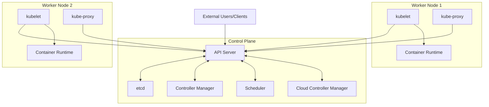

### Control Plane Components

The control plane is responsible for maintaining the desired state of the cluster. It makes global decisions about the cluster (such as scheduling) and detects and responds to cluster events.

#### API Server

The Kubernetes API server (`kube-apiserver`) is the front end for the Kubernetes control plane. It exposes the Kubernetes API and is designed to scale horizontally.

**Key functions**:
- Serves as the primary interface for all cluster interactions
- Validates and processes RESTful API requests
- Updates the corresponding objects in etcd
- Acts as a gateway to the cluster

**Example API Request**:
```bash
kubectl get pods --namespace=default
```

#### Scheduler

The Kubernetes scheduler (`kube-scheduler`) watches for newly created pods that have no node assigned and selects a node for them to run on.

**Key functions**:
- Considers resource requirements, hardware/software/policy constraints, and data locality
- Makes scheduling decisions based on available resources and workload requirements
- Binds pods to nodes through the API server

**Scheduling process**:
1. Filter nodes that cannot run the pod (insufficient resources)
2. Rank remaining nodes by priority
3. Select the highest-priority node

#### Controller Manager

The Kubernetes controller manager (`kube-controller-manager`) runs controller processes that regulate the state of the system.

**Key controllers**:
- **Node Controller**: Notices and responds when nodes go down
- **Replication Controller**: Maintains the correct number of pods for every replication controller object
- **Endpoints Controller**: Populates the Endpoints object (joins Services & Pods)
- **Service Account & Token Controllers**: Create default accounts and API access tokens

#### etcd

etcd is a consistent and highly-available key-value store used as Kubernetes' backing store for all cluster data.

**Key characteristics**:
- Stores configuration data and state information
- Uses the Raft consensus algorithm for consistency
- Sensitive to disk latency - requires SSD for production
- Regular backups are essential

**Example etcd data**:
```json
{
  "/registry/pods/default/nginx-pod": {
    "kind": "Pod",
    "apiVersion": "v1",
    "metadata": {
      "name": "nginx-pod",
      "namespace": "default"
    },
    "spec": {
      "containers": [
        {
          "name": "nginx",
          "image": "nginx:1.19"
        }
      ]
    }
  }
}
```

### Worker Node Components

Worker nodes are the machines that run containerized applications. Each node contains the services necessary to run pods.

#### Kubelet

The kubelet is an agent that runs on each node, ensuring that containers are running in a pod.

**Key functions**:
- Takes a set of PodSpecs (YAML/JSON descriptions of pods) from various sources
- Ensures the containers described in those PodSpecs are running and healthy
- Reports node and pod status to the API server
- Manages container lifecycle events

**Example kubelet command**:
```bash
kubelet --kubeconfig=/var/lib/kubelet/kubeconfig --config=/var/lib/kubelet/config.yaml
```

#### Kube-proxy

Kube-proxy is a network proxy that runs on each node, implementing part of the Kubernetes Service concept.

**Key functions**:
- Maintains network rules on nodes
- Manages connection forwarding or load balancing for service endpoints
- Implements iptables or IPVS rules to handle routing
- Provides cluster-internal service discovery and load balancing

**Network modes**:
- **iptables mode**: Uses Linux iptables rules (default)
- **IPVS mode**: For clusters with high numbers of services
- **userspace mode**: Legacy mode (rarely used now)

#### Container Runtime

The container runtime is the software responsible for running containers.

**Supported runtimes**:
- **containerd**: A lightweight, high-performance runtime (widely used)
- **CRI-O**: Optimized for Kubernetes
- **Docker Engine**: Through the dockershim (deprecated in newer versions)

**Container Runtime Interface (CRI)**:
- Standardized API between Kubernetes and container runtimes
- Allows interchangeability of container runtimes

## Kubernetes Objects

Kubernetes objects are persistent entities in the Kubernetes system representing the state of your cluster.

### Workloads

Workload resources manage the lifecycle of containerized applications.

#### Pods

Pods are the smallest deployable units in Kubernetes, consisting of one or more containers that share resources.

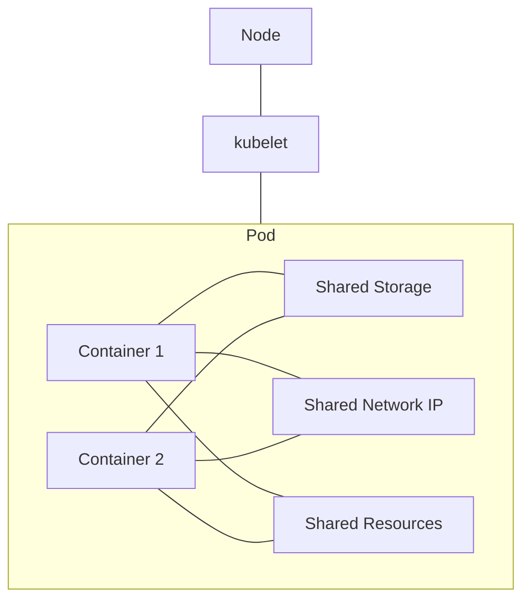

**Key characteristics**:
- Ephemeral (non-persistent) by nature
- Share a single network namespace (same IP and port space)
- Can communicate via localhost
- Have a unique IP address within the cluster

**Example Pod YAML**:
```yaml
apiVersion: v1
kind: Pod
metadata:
  name: nginx-pod
  labels:
    app: nginx
spec:
  containers:
  - name: nginx
    image: nginx:1.19
    ports:
    - containerPort: 80
```

#### ReplicaSets

A ReplicaSet ensures that a specified number of pod replicas are running at any given time.

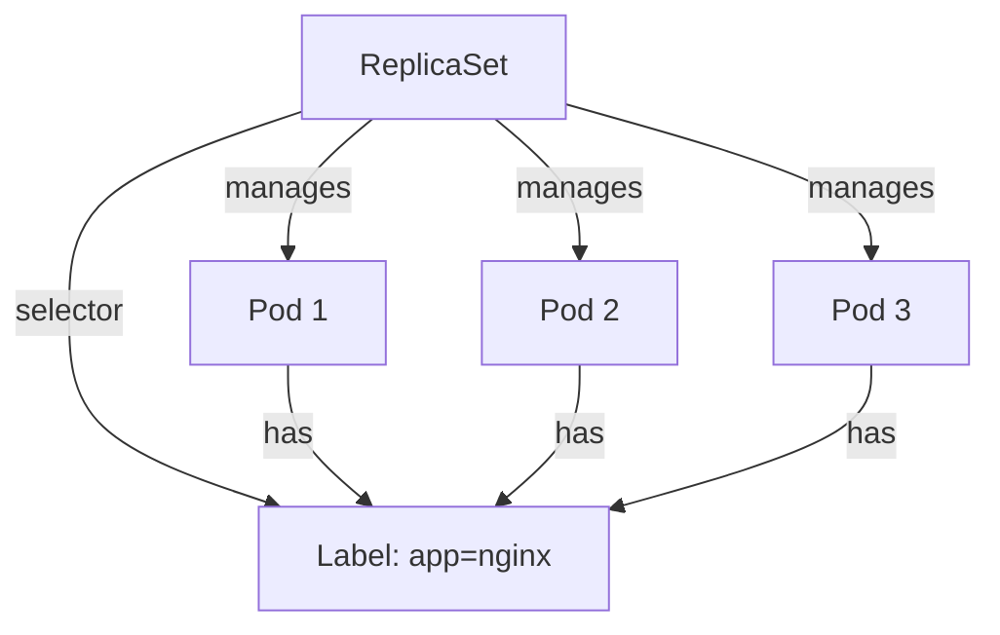

**Key functions**:
- Maintains a stable set of replica pods
- Specified by a selector to identify which pods it can acquire
- Ensures availability and scalability

**Example ReplicaSet YAML**:
```yaml
apiVersion: apps/v1
kind: ReplicaSet
metadata:
  name: nginx-replicaset
  labels:
    app: nginx
spec:
  replicas: 3
  selector:
    matchLabels:
      app: nginx
  template:
    metadata:
      labels:
        app: nginx
    spec:
      containers:
      - name: nginx
        image: nginx:1.19
        ports:
        - containerPort: 80
```

#### Deployments

Deployments provide declarative updates for Pods and ReplicaSets, managing application releases and rollbacks.

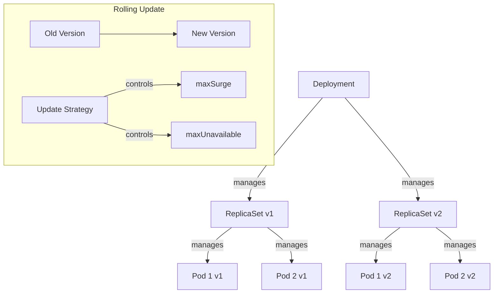

**Key capabilities**:
- Scaling application up or down
- Rolling updates of container images
- Rollbacks to previous versions
- Pause and resume deployments

**Example Deployment YAML**:
```yaml
apiVersion: apps/v1
kind: Deployment
metadata:
  name: nginx-deployment
  labels:
    app: nginx
spec:
  replicas: 3
  selector:
    matchLabels:
      app: nginx
  strategy:
    type: RollingUpdate
    rollingUpdate:
      maxSurge: 1
      maxUnavailable: 1
  template:
    metadata:
      labels:
        app: nginx
    spec:
      containers:
      - name: nginx
        image: nginx:1.19
        ports:
        - containerPort: 80
```

**Deployment vs ReplicaSet**:
- Deployments are higher-level concepts that manage ReplicaSets
- Deployments add rollout and rollback capabilities
- Most applications should use Deployments instead of directly creating ReplicaSets

#### StatefulSets

StatefulSets manage stateful applications, maintaining a sticky identity for each pod.

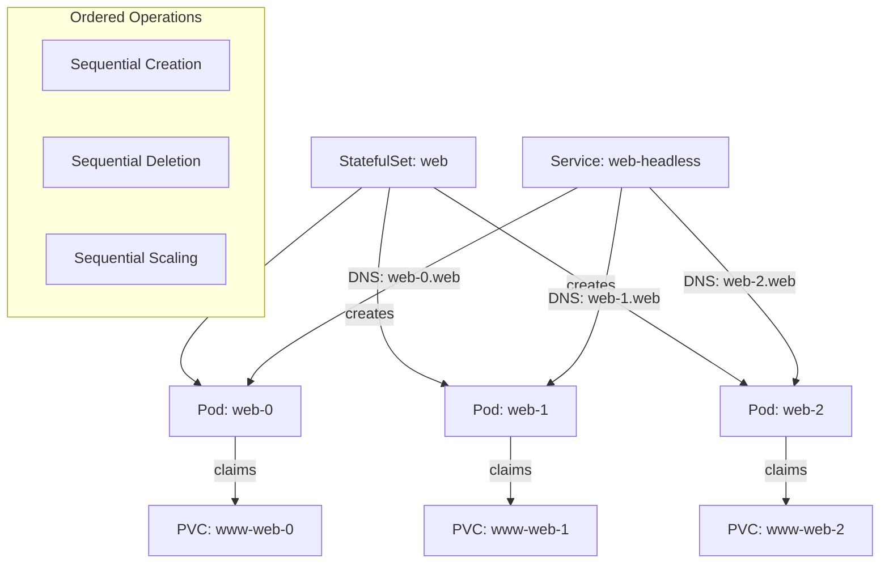

**Key characteristics**:
- Provides stable, unique network identifiers
- Stable, persistent storage
- Ordered, graceful deployment and scaling
- Ordered, automated rolling updates

**Use cases**:
- Databases (MySQL, PostgreSQL)
- Clustered applications (Elasticsearch, MongoDB)
- Applications requiring stable hostnames

**Example StatefulSet YAML**:
```yaml
apiVersion: apps/v1
kind: StatefulSet
metadata:
  name: web
spec:
  serviceName: "nginx"
  replicas: 3
  selector:
    matchLabels:
      app: nginx
  template:
    metadata:
      labels:
        app: nginx
    spec:
      containers:
      - name: nginx
        image: nginx:1.19
        ports:
        - containerPort: 80
          name: web
        volumeMounts:
        - name: www
          mountPath: /usr/share/nginx/html
  volumeClaimTemplates:
  - metadata:
      name: www
    spec:
      accessModes: [ "ReadWriteOnce" ]
      resources:
        requests:
          storage: 1Gi
```

### Networking

Kubernetes networking enables communication between different components and exposes applications to the outside world.

#### Services

Services provide a consistent way to access a logical set of pods, acting as an abstraction layer.

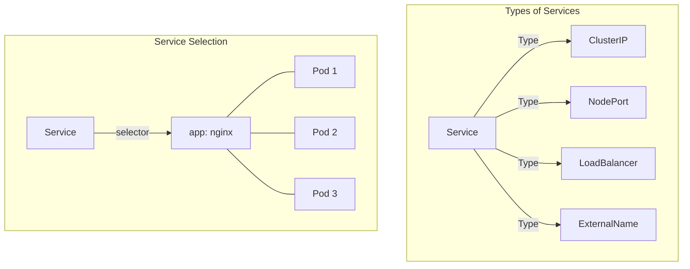

**Service Types**:

1. **ClusterIP** (default):
   - Exposes the service on a cluster-internal IP
   - Only reachable within the cluster
   - Used for internal service-to-service communication
   
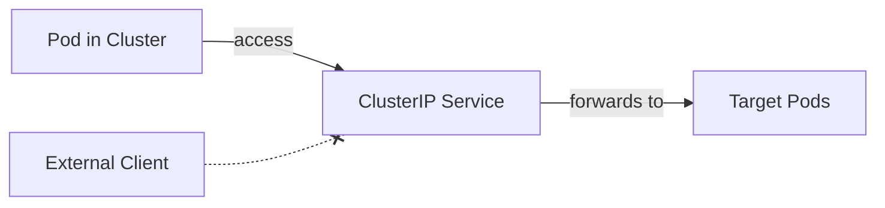

```yaml
apiVersion: v1
kind: Service
metadata:
  name: nginx-service
spec:
  selector:
    app: nginx
  ports:
  - port: 80
    targetPort: 80
  type: ClusterIP
```

2. **NodePort**:
   - Exposes the service on each node's IP at a static port
   - Accessible from outside the cluster using `<NodeIP>:<NodePort>`
   - Port range is typically 30000-32767
   
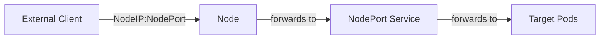

```yaml
apiVersion: v1
kind: Service
metadata:
  name: nginx-nodeport
spec:
  selector:
    app: nginx
  ports:
  - port: 80
    targetPort: 80
    nodePort: 30080
  type: NodePort
```

3. **LoadBalancer**:
   - Exposes the service externally using a cloud provider's load balancer
   - Creates NodePort and ClusterIP services automatically
   - Works with cloud providers like AWS, GCP, Azure
   
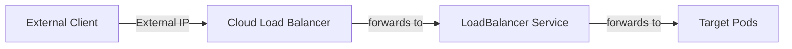

```yaml
apiVersion: v1
kind: Service
metadata:
  name: nginx-lb
spec:
  selector:
    app: nginx
  ports:
  - port: 80
    targetPort: 80
  type: LoadBalancer
```

4. **ExternalName**:
   - Maps the service to a DNS name, not to selectors
   - Used for service discovery to external services
   
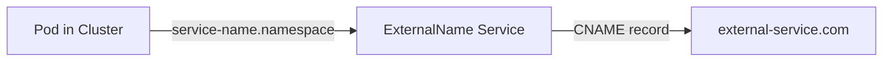

```yaml
apiVersion: v1
kind: Service
metadata:
  name: external-service
spec:
  type: ExternalName
  externalName: example.com
```

#### Ingress

Ingress manages external access to services, providing HTTP and HTTPS routing, SSL termination, and name-based virtual hosting.

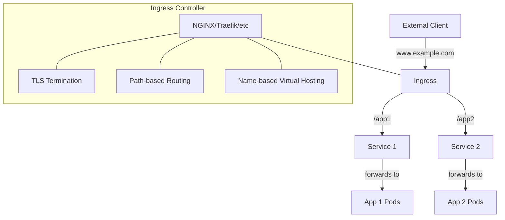

**Key functions**:
- URL path-based routing
- SSL/TLS termination
- Name-based virtual hosting
- Load balancing

**Example Ingress YAML**:
```yaml
apiVersion: networking.k8s.io/v1
kind: Ingress
metadata:
  name: minimal-ingress
  annotations:
    nginx.ingress.kubernetes.io/rewrite-target: /
spec:
  rules:
  - host: www.example.com
    http:
      paths:
      - path: /app1
        pathType: Prefix
        backend:
          service:
            name: service1
            port:
              number: 80
      - path: /app2
        pathType: Prefix
        backend:
          service:
            name: service2
            port:
              number: 80
  tls:
  - hosts:
    - www.example.com
    secretName: example-tls
```

#### Ingress Controllers

Ingress controllers implement the Ingress resource functionality.

**Popular Ingress Controllers**:
- **NGINX Ingress Controller**: Highly configurable, good performance
- **Traefik**: Great for microservices, dynamic configuration
- **HAProxy**: High performance, mature load balancer
- **Kong**: API Gateway with Ingress capabilities
- **AWS ALB Ingress Controller**: Integrates with AWS Application Load Balancer

**Deployment considerations**:
- Ingress controllers are not started automatically with a cluster
- Multiple ingress controllers can co-exist in the same cluster
- Cloud-specific controllers might be available (GKE, AKS, EKS)

### Storage and Configuration

Kubernetes provides various ways to manage application configuration and persistent storage.

#### ConfigMaps

ConfigMaps allow you to decouple configuration from container images, making applications more portable.

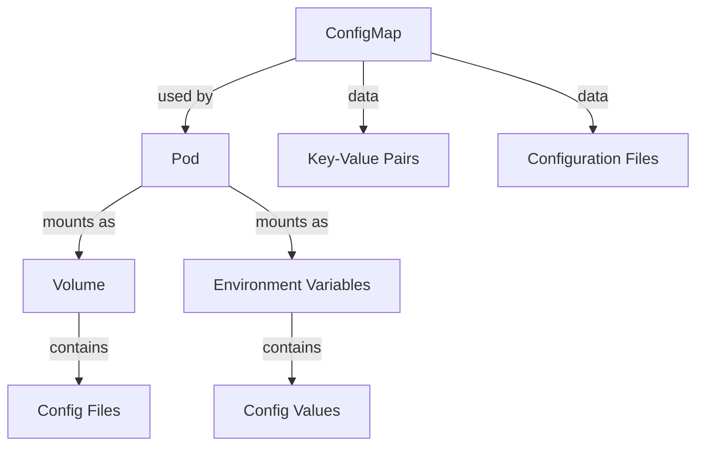

**Use cases**:
- Environment variables
- Command-line arguments
- Configuration files in volumes

**Example ConfigMap YAML**:
```yaml
apiVersion: v1
kind: ConfigMap
metadata:
  name: app-config
data:
  app.properties: |
    environment=production
    logging.level=info
  ui.properties: |
    color.theme=dark
    font.size=medium
```

**Using ConfigMap in a Pod**:
```yaml
apiVersion: v1
kind: Pod
metadata:
  name: app-pod
spec:
  containers:
  - name: app
    image: myapp:1.0
    volumeMounts:
    - name: config-volume
      mountPath: /etc/config
    env:
    - name: ENVIRONMENT
      valueFrom:
        configMapKeyRef:
          name: app-config
          key: environment
  volumes:
  - name: config-volume
    configMap:
      name: app-config
```

#### PersistentVolumes and PersistentVolumeClaims

PersistentVolumes (PVs) provide storage resources in a cluster, while PersistentVolumeClaims (PVCs) request storage resources.

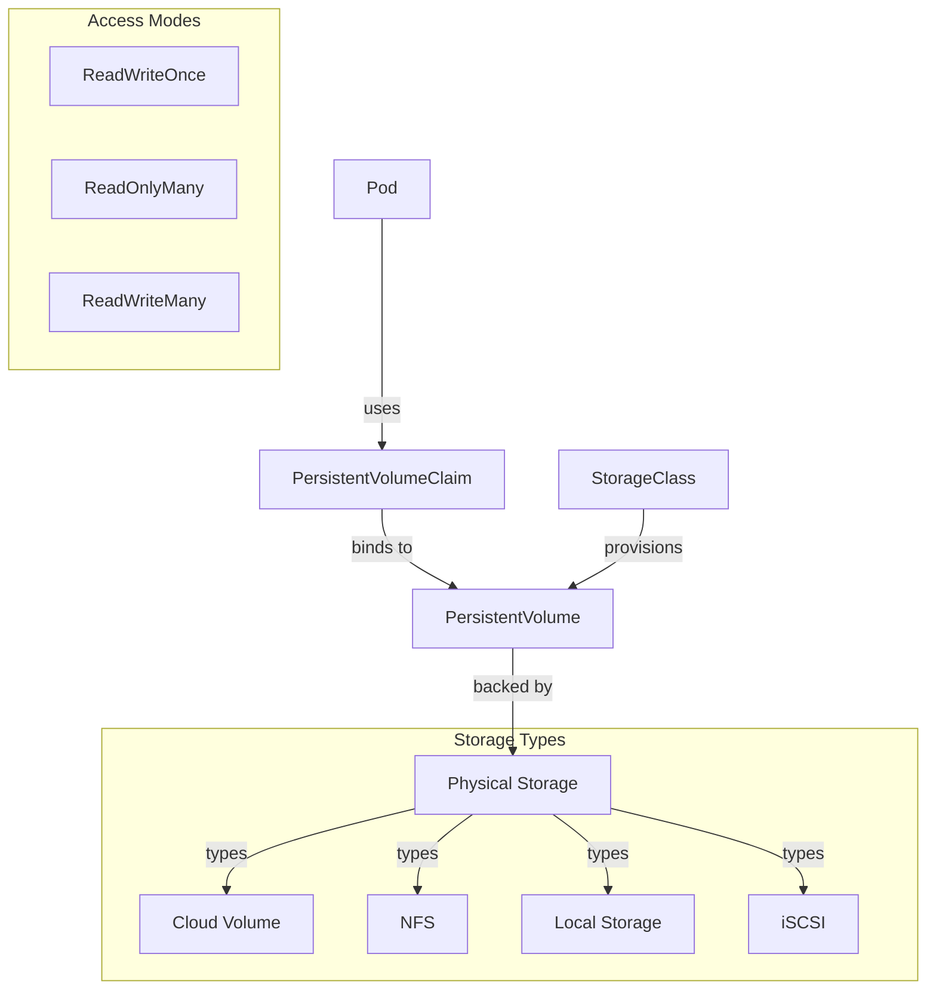

**PersistentVolume Example**:
```yaml
apiVersion: v1
kind: PersistentVolume
metadata:
  name: pv-storage
spec:
  capacity:
    storage: 10Gi
  volumeMode: Filesystem
  accessModes:
    - ReadWriteOnce
  persistentVolumeReclaimPolicy: Retain
  storageClassName: standard
  hostPath:
    path: /data/pv0001
```

**PersistentVolumeClaim Example**:
```yaml
apiVersion: v1
kind: PersistentVolumeClaim
metadata:
  name: pvc-storage
spec:
  accessModes:
    - ReadWriteOnce
  resources:
    requests:
      storage: 5Gi
  storageClassName: standard
```

**Using PVC in a Pod**:
```yaml
apiVersion: v1
kind: Pod
metadata:
  name: database-pod
spec:
  containers:
  - name: database
    image: mysql:5.7
    volumeMounts:
    - name: data-volume
      mountPath: /var/lib/mysql
  volumes:
  - name: data-volume
    persistentVolumeClaim:
      claimName: pvc-storage
```

**Storage Classes**:
- Provide a way to describe different "classes" of storage
- Dynamic provisioning based on storage requirements
- Cloud provider integration (AWS EBS, GCE PD, Azure Disk)

#### Secrets

Secrets store sensitive information, such as passwords, OAuth tokens, and SSH keys.

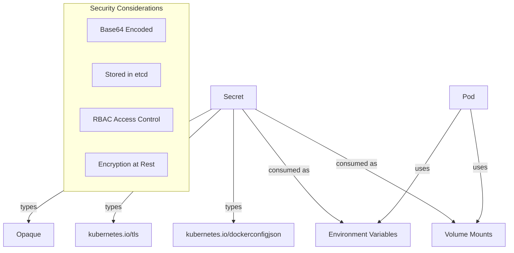

**Key features**:
- Base64 encoded (not encrypted by default)
- Stored in etcd
- Can be mounted as files or environment variables
- Access can be limited using RBAC

**Example Secret YAML**:
```yaml
apiVersion: v1
kind: Secret
metadata:
  name: db-credentials
type: Opaque
data:
  username: YWRtaW4=  # admin (base64 encoded)
  password: cGFzc3dvcmQxMjM=  # password123 (base64 encoded)
```

**Using Secret in a Pod**:
```yaml
apiVersion: v1
kind: Pod
metadata:
  name: db-app
spec:
  containers:
  - name: app
    image: myapp:1.0
    env:
    - name: DB_USERNAME
      valueFrom:
        secretKeyRef:
          name: db-credentials
          key: username
    - name: DB_PASSWORD
      valueFrom:
        secretKeyRef:
          name: db-credentials
          key: password
```

## Kubernetes Workflow

The following describes a typical workflow for deploying applications to Kubernetes:

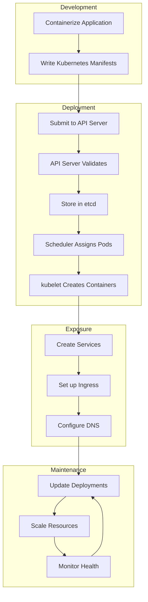

1. **Development**:
   - Containerize application
   - Write Kubernetes manifests (YAML files)

2. **Deployment**:
   - Submit manifests to API Server
   - API Server validates and stores configuration in etcd
   - Scheduler assigns pods to nodes
   - kubelet creates and manages containers

3. **Application Access**:
   - Create Services to expose applications
   - Set up Ingress for HTTP/HTTPS routing
   - Configure external DNS if needed

4. **Maintenance**:
   - Update deployments (rolling updates)
   - Scale resources up or down
   - Monitor application health

