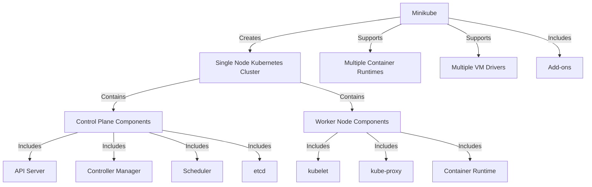
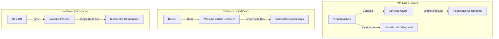

# Minikube Tutorial: Installation and Usage Guide

## Table of Contents

- [Introduction to Minikube](#introduction-to-minikube)
- [Prerequisites](#prerequisites)
- [Installing Minikube on Linux](#installing-minikube-on-linux)
  - [Linux with Docker Driver](#linux-with-docker-driver)
  - [Linux without Docker](#linux-without-docker)
- [Installing Minikube on macOS](#installing-minikube-on-macos)
  - [macOS with Docker Driver](#macos-with-docker-driver)
- [Installing Minikube on Windows](#installing-minikube-on-windows)
  - [Windows with Docker Driver](#windows-with-docker-driver)
- [Basic Minikube Operations](#basic-minikube-operations)
- [Working with Kubernetes in Minikube](#working-with-kubernetes-in-minikube)
- [Monitoring and Managing Resources](#monitoring-and-managing-resources)
- [Troubleshooting](#troubleshooting)
- [Advanced Minikube Usage](#advanced-minikube-usage)

## Introduction to Minikube

Minikube is a tool that enables you to run Kubernetes locally. It creates a single-node Kubernetes cluster inside a Virtual Machine (VM) or container on your laptop or desktop for users looking to try out Kubernetes or develop with it day-to-day.

**Key features of Minikube:**

- Easy installation and setup process
- Supports the latest Kubernetes release
- Cross-platform (Linux, macOS, Windows)
- Supports multiple container runtimes (Docker, containerd, CRI-O)
- Supports various VM drivers (VirtualBox, Hyper-V, KVM, etc.)
- Add-ons for additional functionality
- Built-in Docker registry

### Minikube Architecture Overview



### Driver Architecture Models



## Prerequisites

Before installing Minikube, ensure your system meets the following requirements:

### General Requirements

- 2 CPUs or more
- 2GB of free memory
- 20GB of free disk space
- Internet connection
- Container or virtual machine manager (Docker, VirtualBox, Hyper-V, etc.)
- kubectl command-line tool

### Platform-Specific Requirements

#### Linux
- Linux kernel version 4.x or newer
- Hardware virtualization support (if using VM-based drivers)

#### macOS
- macOS 10.13 (High Sierra) or newer
- Hardware virtualization support (if using VM-based drivers)

#### Windows
- Windows 10 64-bit (Professional, Enterprise, or Education editions)
- Hardware virtualization support (if using VM-based drivers)
- Hyper-V or WSL2 enabled (if using those drivers)

## Installing Minikube on Linux

### Linux with Docker Driver

The Docker driver is the recommended approach for Minikube on Linux due to its lightweight nature and faster startup times.

#### Step 1: Install Docker

First, ensure Docker is installed on your system:

```bash
# Update package index
sudo apt-get update -y

# Install packages to allow apt to use a repository over HTTPS
sudo apt-get install -y \
    apt-transport-https \
    ca-certificates \
    curl \
    gnupg-agent \
    software-properties-common

# Add Docker's official GPG key
curl -fsSL https://download.docker.com/linux/ubuntu/gpg | sudo apt-key add -

# Set up the stable repository (for Ubuntu - adjust for other distributions)
sudo add-apt-repository \
   "deb [arch=amd64] https://download.docker.com/linux/ubuntu \
   $(lsb_release -cs) \
   stable"

# Install Docker Engine
sudo apt-get update -y
sudo apt-get install -y docker-ce docker-ce-cli containerd.io

# Add your user to the docker group to run Docker without sudo
sudo usermod -aG docker $USER
newgrp docker
```

#### Step 2: Install kubectl

Install the kubectl command-line tool:

```bash
# Download the latest version
curl -LO "https://dl.k8s.io/release/$(curl -L -s https://dl.k8s.io/release/stable.txt)/bin/linux/amd64/kubectl"

# Make the binary executable
chmod +x kubectl

# Move the binary to your PATH
sudo mv kubectl /usr/local/bin/

# Verify installation
kubectl version --client
```

#### Step 3: Install Minikube

Install Minikube using the following commands:

```bash
# Download the latest Minikube binary
curl -LO https://storage.googleapis.com/minikube/releases/latest/minikube-linux-amd64

# Make it executable
chmod +x minikube-linux-amd64

# Move it to your PATH
sudo install minikube-linux-amd64 /usr/local/bin/minikube

# Verify installation
minikube version
```

#### Step 4: Start Minikube with Docker Driver

Start Minikube using the Docker driver:

```bash
minikube start --driver=docker
```

You can set Docker as your default driver:

```bash
minikube config set driver docker
```

#### Step 5: Verify Installation

Verify that Minikube is running correctly:

```bash
minikube status
```

You should see output similar to:

```
minikube
type: Control Plane
host: Running
kubelet: Running
apiserver: Running
kubeconfig: Configured
```

### Linux without Docker

For running Minikube without Docker, you can use VM-based drivers like KVM or VirtualBox.

#### Using KVM Driver

KVM (Kernel-based Virtual Machine) is a virtualization infrastructure for the Linux kernel that turns it into a hypervisor.

##### Step 1: Install KVM

```bash
# Install required packages for KVM
sudo apt update -y
sudo apt install -y qemu-kvm libvirt-daemon-system libvirt-clients bridge-utils

# Add your user to the libvirt group
sudo usermod -aG libvirt $USER
sudo usermod -aG kvm $USER

# Restart libvirtd service
sudo systemctl restart libvirtd

# Log out and log back in for group changes to take effect
```

##### Step 2: Install the KVM Driver for Minikube

```bash
# Install the Docker Machine KVM driver
curl -LO https://storage.googleapis.com/minikube/releases/latest/docker-machine-driver-kvm2
chmod +x docker-machine-driver-kvm2
sudo mv docker-machine-driver-kvm2 /usr/local/bin/
```

##### Step 3: Install kubectl

Follow the same instructions as in the Docker driver section.

##### Step 4: Install Minikube

Follow the same instructions as in the Docker driver section.

##### Step 5: Start Minikube with KVM Driver

```bash
minikube start --driver=kvm2
```

You can set KVM as your default driver:

```bash
minikube config set driver kvm2
```

#### Using VirtualBox Driver

VirtualBox is a free and open-source hosted hypervisor that runs on many platforms.

##### Step 1: Install VirtualBox

```bash
# Add VirtualBox repository
sudo apt update -y
sudo apt install -y virtualbox virtualbox-ext-pack
```

##### Step 2: Install kubectl

Follow the same instructions as in the Docker driver section.

##### Step 3: Install Minikube

Follow the same instructions as in the Docker driver section.

##### Step 4: Start Minikube with VirtualBox Driver

```bash
minikube start --driver=virtualbox
```

You can set VirtualBox as your default driver:

```bash
minikube config set driver virtualbox
```

## Installing Minikube on macOS

### macOS with Docker Driver

#### Step 1: Install Docker Desktop

1. Download Docker Desktop for Mac from the [Docker website](https://www.docker.com/products/docker-desktop)
2. Install the downloaded `.dmg` file
3. Start Docker Desktop and ensure it's running (check for the Docker icon in the menu bar)

#### Step 2: Install kubectl

Use Homebrew to install kubectl:

```bash
brew install kubectl

# Verify installation
kubectl version --client
```

Alternatively, you can install kubectl manually:

```bash
# Download the latest version
curl -LO "https://dl.k8s.io/release/$(curl -L -s https://dl.k8s.io/release/stable.txt)/bin/darwin/amd64/kubectl"

# Make the binary executable
chmod +x kubectl

# Move the binary to your PATH
sudo mv kubectl /usr/local/bin/

# Verify installation
kubectl version --client
```

#### Step 3: Install Minikube

Use Homebrew to install Minikube:

```bash
brew install minikube

# Verify installation
minikube version
```

Alternatively, you can install Minikube manually:

```bash
# Download the latest Minikube binary
curl -LO https://storage.googleapis.com/minikube/releases/latest/minikube-darwin-amd64

# Make it executable
chmod +x minikube-darwin-amd64

# Move it to your PATH
sudo install minikube-darwin-amd64 /usr/local/bin/minikube

# Verify installation
minikube version
```

#### Step 4: Start Minikube with Docker Driver

Start Minikube using the Docker driver:

```bash
minikube start --driver=docker
```

You can set Docker as your default driver:

```bash
minikube config set driver docker
```

#### Step 5: Verify Installation

Verify that Minikube is running correctly:

```bash
minikube status
```

You should see output indicating that Minikube is running successfully.

## Installing Minikube on Windows

### Windows with Docker Driver

#### Step 1: Install Docker Desktop

1. Download Docker Desktop for Windows from the [Docker website](https://www.docker.com/products/docker-desktop)
2. Install the downloaded executable
3. Start Docker Desktop and ensure it's running (check for the Docker icon in the system tray)
4. Right-click on the Docker icon and ensure that "Use WSL 2 based engine" is checked in the Settings

#### Step 2: Install kubectl

Use Chocolatey to install kubectl (install Chocolatey first if you don't have it):

```powershell
choco install kubernetes-cli

# Verify installation
kubectl version --client
```

Alternatively, you can install kubectl manually:

1. Download the latest kubectl:
   ```powershell
   curl.exe -LO "https://dl.k8s.io/release/v1.28.0/bin/windows/amd64/kubectl.exe"
   ```

2. Add the binary to your PATH or move it to a location in your PATH

3. Verify installation:
   ```powershell
   kubectl version --client
   ```

#### Step 3: Install Minikube

Use Chocolatey to install Minikube:

```powershell
choco install minikube

# Verify installation
minikube version
```

Alternatively, you can install Minikube manually:

1. Download the latest Minikube installer:
   - Visit [Minikube Releases](https://github.com/kubernetes/minikube/releases)
   - Download the latest `minikube-installer.exe`

2. Run the installer

3. Verify installation:
   ```powershell
   minikube version
   ```

#### Step 4: Start Minikube with Docker Driver

Open PowerShell as Administrator and start Minikube:

```powershell
minikube start --driver=docker
```

You can set Docker as your default driver:

```powershell
minikube config set driver docker
```

#### Step 5: Verify Installation

Verify that Minikube is running correctly:

```powershell
minikube status
```

## Basic Minikube Operations

Once you have Minikube installed, here are some essential commands to manage your local Kubernetes cluster:

### Cluster Management

```bash
# Start the Minikube cluster
minikube start

# Stop the Minikube cluster
minikube stop

# Delete the Minikube cluster
minikube delete

# Pause Kubernetes
minikube pause

# Unpause Kubernetes
minikube unpause

# Get cluster status
minikube status

# Get cluster IP
minikube ip
```

### Configuration Options

```bash
# Start with specific Kubernetes version
minikube start --kubernetes-version=v1.25.0

# Start with specific resources
minikube start --cpus=4 --memory=8192mb --disk-size=30g

# Start with additional options
minikube start --extra-config=kubelet.MaxPods=100

# Set default driver
minikube config set driver docker

# View Minikube configuration
minikube config view
```

### Accessing the Kubernetes Dashboard

```bash
# Start the dashboard
minikube dashboard

# Get the dashboard URL without opening the browser
minikube dashboard --url
```

### SSH into the Minikube VM

```bash
# SSH into the Minikube VM (for VM-based drivers)
minikube ssh

# Run a command in the Minikube environment
minikube ssh "kubectl get pods -A"
```

### Working with Minikube Docker Daemon

When using Docker as a container runtime, you can point your local Docker client to the Minikube Docker daemon:

#### On Linux and macOS

```bash
# Point your Docker client to the Minikube Docker daemon
eval $(minikube docker-env)

# Build a Docker image with the Minikube Docker daemon
docker build -t my-app:latest .

# Revert to using the local Docker daemon
eval $(minikube docker-env -u)
```

#### On Windows (PowerShell)

```powershell
# Point your Docker client to the Minikube Docker daemon
& minikube -p minikube docker-env --shell powershell | Invoke-Expression

# Build a Docker image with the Minikube Docker daemon
docker build -t my-app:latest .

# Revert to using the local Docker daemon
& minikube -p minikube docker-env --shell powershell -u | Invoke-Expression
```

## Working with Kubernetes in Minikube

### Deploying Applications

#### Using kubectl apply

```bash
# Create a deployment using kubectl
kubectl create deployment hello-minikube --image=k8s.gcr.io/echoserver:1.10

# Expose the deployment as a service
kubectl expose deployment hello-minikube --type=NodePort --port=8080

# Access the service
minikube service hello-minikube
```

#### Using YAML Files

```bash
# Create resources defined in a YAML file
kubectl apply -f deployment.yaml

# Delete resources defined in a YAML file
kubectl delete -f deployment.yaml
```

Example `deployment.yaml`:

```yaml
apiVersion: apps/v1
kind: Deployment
metadata:
  name: nginx-deployment
spec:
  replicas: 3
  selector:
    matchLabels:
      app: nginx
  template:
    metadata:
      labels:
        app: nginx
    spec:
      containers:
      - name: nginx
        image: nginx:1.19
        ports:
        - containerPort: 80
---
apiVersion: v1
kind: Service
metadata:
  name: nginx-service
spec:
  selector:
    app: nginx
  ports:
  - port: 80
    targetPort: 80
  type: NodePort
```

### Using Minikube Add-ons

Minikube comes with several built-in add-ons that enhance its functionality:

```bash
# List available add-ons
minikube addons list

# Enable an add-on
minikube addons enable <addon-name>

# Disable an add-on
minikube addons disable <addon-name>

# Open an add-on in the browser
minikube addons open <addon-name>
```

Popular add-ons include:

- **dashboard**: The Kubernetes Dashboard web UI
- **ingress**: The NGINX Ingress Controller
- **metrics-server**: For container resource metrics
- **registry**: A Docker registry
- **storage-provisioner**: Default storage class and provisioner
- **metallb**: Load balancer implementation

Example: Enabling the Ingress add-on

```bash
# Enable the Ingress add-on
minikube addons enable ingress

# Verify that the Ingress controller is running
kubectl get pods -n ingress-nginx
```

Example `ingress.yaml`:

```yaml
apiVersion: networking.k8s.io/v1
kind: Ingress
metadata:
  name: example-ingress
spec:
  rules:
  - host: example.com
    http:
      paths:
      - path: /
        pathType: Prefix
        backend:
          service:
            name: nginx-service
            port:
              number: 80
```

Apply the Ingress resource:

```bash
kubectl apply -f ingress.yaml
```

Add the host to your /etc/hosts file:

```bash
echo "$(minikube ip) example.com" | sudo tee -a /etc/hosts
```

### Using Helm with Minikube

[Helm](https://helm.sh/) is a package manager for Kubernetes that simplifies deploying applications:

#### Installing Helm

On Linux/macOS:

```bash
curl https://raw.githubusercontent.com/helm/helm/main/scripts/get-helm-3 | bash
```

On Windows (with Chocolatey):

```powershell
choco install kubernetes-helm
```

#### Using Helm Charts

```bash
# Add a Helm repository
helm repo add bitnami https://charts.bitnami.com/bitnami

# Update repositories
helm repo update

# Install a chart
helm install my-release bitnami/wordpress

# List releases
helm list

# Uninstall a release
helm uninstall my-release
```

## Monitoring and Managing Resources

### Viewing Logs

```bash
# View logs for a pod
kubectl logs <pod-name>

# Follow logs
kubectl logs -f <pod-name>

# View logs for all containers in a pod
kubectl logs <pod-name> --all-containers

# View logs for a specific container in a pod
kubectl logs <pod-name> -c <container-name>
```

### Monitoring Resources

```bash
# Get pods in the current namespace
kubectl get pods

# Get pods in all namespaces
kubectl get pods -A

# Get more details about pods
kubectl get pods -o wide

# Describe a specific pod
kubectl describe pod <pod-name>

# Watch for changes in resources
kubectl get pods --watch
```

### Resource Management

```bash
# Scale a deployment
kubectl scale deployment <deployment-name> --replicas=<count>

# Delete a resource
kubectl delete pod <pod-name>

# Delete a deployment and its pods
kubectl delete deployment <deployment-name>

# Apply a rolling update to a deployment
kubectl set image deployment/<deployment-name> <container-name>=<new-image>
```

### Port Forwarding

To access a pod directly:

```bash
# Forward a local port to a port on the pod
kubectl port-forward <pod-name> <local-port>:<pod-port>

# Example: Access a Redis pod on port 6379
kubectl port-forward redis-master-765d459796-258hz 7000:6379
```

## Troubleshooting

### Common Issues

#### Insufficient Resources

**Symptom**: Minikube fails to start with resource-related errors.

**Solution**: Allocate more resources:

```bash
minikube start --cpus=4 --memory=4096
```

#### Driver-Related Issues

**Symptom**: Errors when starting Minikube related to the VM driver.

**Solution**: Try a different driver:

```bash
minikube start --driver=docker
# or
minikube start --driver=virtualbox
```

#### Network Issues

**Symptom**: Unable to pull images or access Kubernetes API.

**Solution**: Check network connectivity and proxy settings:

```bash
# Set HTTP_PROXY environment variables if behind a proxy
export HTTP_PROXY=http://proxy-host:port
export HTTPS_PROXY=http://proxy-host:port
export NO_PROXY=localhost,127.0.0.1,10.96.0.0/12,192.168.99.0/24,192.168.39.0/24

# Start Minikube with proxy settings
minikube start --docker-env HTTP_PROXY=$HTTP_PROXY --docker-env HTTPS_PROXY=$HTTPS_PROXY --docker-env NO_PROXY=$NO_PROXY
```

#### Image Pull Errors

**Symptom**: `ImagePullBackOff` or `ErrImagePull` errors.

**Solution**: Ensure Docker has access to the required images:

```bash
# Point to Minikube's Docker daemon
eval $(minikube docker-env)

# Pull the image manually
docker pull <image-name>

# Or use a local image
docker build -t <image-name> .
```

### Debugging Commands

```bash
# Get detailed Minikube logs
minikube logs

# Enable verbose logging
minikube start --v=7

# Check Minikube's VM status (for VM-based drivers)
minikube ssh "systemctl status kubelet"

# Check container runtime status
minikube ssh "systemctl status docker" # if using Docker
```

### Updating and Reinstalling

```bash
# Update Minikube to the latest version
minikube update-check

# Clean up and restart from scratch
minikube delete
rm -rf ~/.minikube
minikube start
```

## Advanced Minikube Usage

### Using Multiple Clusters

```bash
# Create a named profile
minikube start -p cluster2

# List profiles
minikube profile list

# Switch between profiles
minikube profile cluster2

# Run commands on a specific profile
minikube -p cluster2 status
```

### Tunneling for LoadBalancer Services

```bash
# Create a tunnel for LoadBalancer services
minikube tunnel

# This allows LoadBalancer services to get external IPs
kubectl get services  # Should show EXTERNAL-IP for LoadBalancer services
```

### Running Minikube without VM (Docker-only)

```bash
# Run Minikube without a VM using only Docker
minikube start --driver=docker --container-runtime=docker
```

### Using Custom CNI (Container Network Interface)

```bash
# Start Minikube with Calico CNI
minikube start --network-plugin=cni --cni=calico
```

### Registry Mirrors for Faster Image Pulls

```bash
# Configure registry mirrors
minikube start --registry-mirror=https://registry.mirror.com
```

### Creating a Multi-Node Cluster

```bash
# Start Minikube with multiple nodes
minikube start --nodes 3

# Check node status
kubectl get nodes
```

### Using a Specific Kubernetes Version

```bash
# List available Kubernetes versions
minikube get-k8s-versions

# Start with a specific version
minikube start --kubernetes-version=v1.25.0
```

### Advanced etcd Configuration

```bash
# Configure etcd
minikube start --extra-config=etcd.quota-backend-bytes=8589934592
```

### Custom API Server Flags

```bash
# Set API server flags
minikube start --extra-config=apiserver.service-node-port-range=80-32767
```

